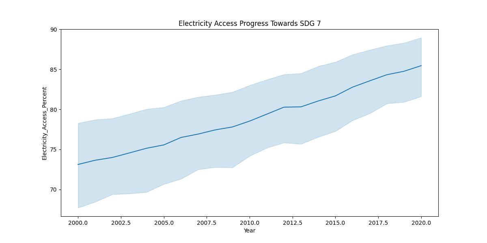
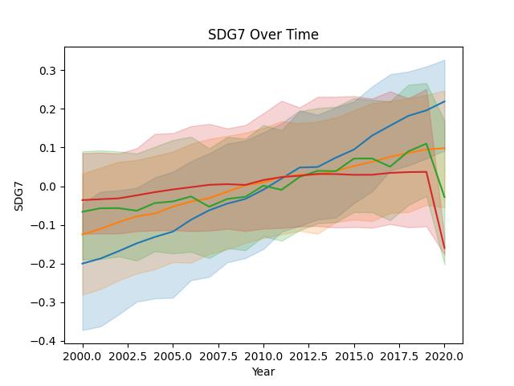
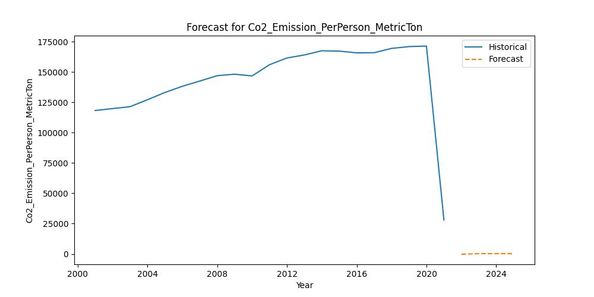
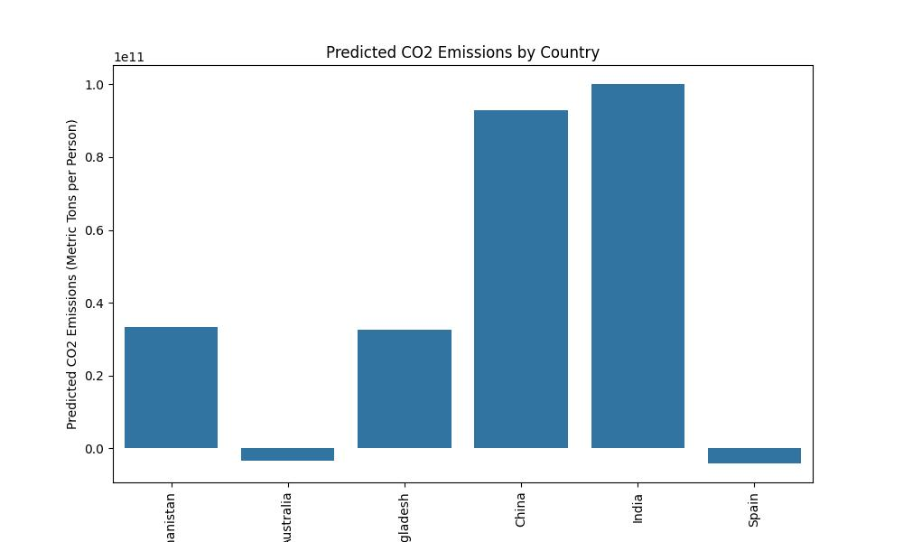

# Sustainability

### DataSet used : 
Global Data on Sustainable Energy (2000-2020) : 
https://www.kaggle.com/datasets/anshtanwar/global-data-on-sustainable-energy

## 1) Business Understanding

### Objective:

I will use this dataset showcasing sustainable energy indicators and other useful factors across all countries from 2000 to 2020. I will dive into vital aspects such as electricity access, renewable energy, carbon emissions, energy intensity, Financial flows, and economic growth. 

### Key Questions:

1. Showcase Sustainable Energy Indicators for all countires
2. How are the nations going to perform in the future against their SDG7 goals
3. Find whether a country's renewable energy consumption is above or below the median.
4. Predict CO2 emissions for all the countries

### Success Criteria:

The Machine Learning alogrithm proposed will enable goverment and related agencies of all countires to track progress towards Sustainable Development Goal 7, and gain profound insights into global energy consumption patterns over time.

## 2. Data Understanding

### Objective 
Familiarize with the dataset, understand the features, and assess the target variable.

### 2.1 Data Collection
-> The dataset has Global Data on Sustainable Energy (2000-2020).

-> The dataset consist of 176 countires

-> 15 Key Features out of the 21 columns from the dataset that I will use for my analysis are :

> 'Year','Country', 'Electricity_Access_Percent', 'CleanFuel_Access_Percent','Renewable_Electricity_PerPerson','Financial_Aids_Dollars','Renewable_Energy_Consumption_AgainstTotalEnergy_Percent','Electricity_from_Fossil_Fuels_TWH','Electricity_from_NuclearPower_TWh','Electricity_from_RenewableSource_TWh','LowCarbon_Electricity_Percent','Primary_Energy_Consumption_PerPerson_kWh', 'Co2_Emission_PerPerson_MetricTon','Annual_GDP_Growth_Percent','GDP_PerPerson_Dollars'

### 2.2 Exploratory Data Analysis (EDA)

**Key Features**:

**Country** : The name of the country or region for which the data is reported.

**Year** : The year for which the data is reported, ranging from 2000 to 2020.

**Electricity_Access_Percent** : The percentage of population with access to electricity.

**CleanFuel_Access_Percent** : The percentage of the population with primary reliance on clean fuels.

**Renewable_Electricity_PerPerson** : Installed Renewable energy capacity per person

**Financial_Aids_Dollars** : Aid and assistance from developed countries for clean energy projects.

**Renewable_Energy_Consumption_AgainstTotalEnergy_Percent** : Percentage of renewable energy in final energy consumption.

**Electricity_from_Fossil_Fuels_TWH** : Electricity generated from fossil fuels (coal, oil, gas) in terawatt-hours.

**Electricity_from_NuclearPower_TWh** : Electricity generated from nuclear power in terawatt-hours.

**Electricity from renewables (TWh)** : Electricity generated from renewable sources (hydro, solar, wind, etc.) in terawatt-hours.

**LowCarbon_Electricity_Percent** : Percentage of electricity from low-carbon sources (nuclear and renewables).

**Primary_Energy_Consumption_PerPerson_kWh** : Energy consumption per person in kilowatt-hours.

**Co2_Emission_PerPerson_MetricTon** : Carbon dioxide emissions per person in metric tons.

**Annual_GDP_Growth_Percent** : Annual GDP growth rate based on constant local currency.

**GDP_PerPerson_Dollars** : Gross domestic product per person in dollars.

## Objectives 1 : : Showcase Sustainable Energy Indicators

The provision of adequate and reliable energy services at an affordable cost, in a secure and environmentally benign manner and in conformity with social and economic development needs, is an essential element of sustainable development.

### 1.1 Features Exploration

Features to be used :
>>'Year', 'Country', 'Electricity_Access_Percent',  'CleanFuel_Access_Percent', 'Renewable_Electricity_PerPerson', 'Co2_Emission_PerPerson_MetricTon'

## 1.2. Data Preparation

**Step 1: key indicators :**
Visualize key indicators related to sustainable energy, such as electricity access, renewable energy consumption, carbon emissions, and energy intensity.

Here we will Filter data for 10 selected countries to minimize higher computational requirement
 >'United States', 'China', 'India', 'Afghanistan', 'Australia', 'Bangladesh', 'Saudi Arabia' 'Mozambique', 'Spain', 'Zimbabwe'
 
 ***Compare Nations and Track Progress***

> By 2020, countries such as United States and China provides 100% Electricity access to all its population, where as in country such as Bangladesh, still 10% of the population doesn't has access to Electricity.

> By 2020, countries such as United States provides 100% Clean Energy access to all its population, where as in country such as Bangladesh, only 20% of the population has access to Clean Energy.

> By 2020, the Renewable Energy Consumption against Totoal Energy per person is still very low. Spain is at 18% and Saudi Arabia is at 0% (which is a shame).

> By 2020, China has the highest CO2 emission worldwide, whereas Spain has the lowest.

**Step 2: Analyze Vital Aspects :** 
We will focus on specific areas such as electricity access, renewable energy, carbon emissions, energy intensity, financial flows, and economic growth.

> At an average, 78.93% of people world wide has Early Access to Electicity

> At an average, 113.14% of people world wide use Renewable energy for Electicity. This higher percentage of consumption is because the data is skued by first world country against developing countries.

> At an average, 1.598665e+05 Metric Ton of CO2 is emitted  per person world wide.

> At an average, 36.80% of people world wide uses electricity from low-carbon sources such as nuclear and renewables.

> At an average, annual GDP growth for a country is 3.44%

> At an average, $13,283.77 is the GDP per person world wide

**Step 3: Worldwide progress towards Sustainable Development Goal 7 :**
We will compare different countries and track their progress towards Sustainable Development Goal 7.

> In the last 20 years (from 2000-2020), Electricity accesd to people across the world has increased by 10%. There is still 17% of the world population who doesn't have access to electricity

**Step 4: Insights into Global Energy Consumption Patterns :**
We will identify trends and patterns in global energy consumption over time.

> In the last 20 years (from 2000-2020), Energy Consumption per person across the world has remained the same, which is around 24,000 KWh.

# Objective 2 :: How are the nations going to perform in the future against their SDG7 goals

Build a time series model to track progress in electricity access, clean fuel access, renewable electricity per person, and CO2 emissions per person over the next four years

### Step 1: Data Processing 
Features to be uses to buildt a Time Series Model :

> Year','Country', 'Electricity_Access_Percent', 'CleanFuel_Access_Percent', 'Renewable_Electricity_PerPerson', 'Co2_Emission_PerPerson_MetricTon'

Handle missing values using KNN Imputation

knn_imputer = KNNImputer(n_neighbors=5)

After imputation, there are no missing values:

Year                                0
Country                             0
Electricity_Access_Percent          0
CleanFuel_Access_Percent            0
Renewable_Electricity_PerPerson     0
Co2_Emission_PerPerson_MetricTon    0

### Step 2: Extract Relevant Features
Select the required features and ensure they are in the correct format.

Since the features are in different units, we will use StandardScaler to scale them.

scaler = StandardScaler()

Visualize the data to check scaled dimensions

SDG7 over time can be visualized here 

###  Step 3: Prepare the data for time series analysis

Ensure the 'Year' column is in datetime format
Set 'Year' as the index
Select the relevant features

### Step 4: Resample the Data

Resample the data to annual frequency

### Step 5: Train-Test Split

Define the split point (e.g., last 4 years for testing)

> split_date = '2016-12-31'

### Step 5: Build a Pipeline

We will first perform a grid search to find the best parameters :

Best ARIMA parameters: (0, 2, 1)

Create a pipeline with StandardScaler and ARIMA. Note that ARIMA models work on univariate time series, so we need to build separate models for each feature.

{'Electricity_Access_Percent': Pipeline(steps=[('scaler', StandardScaler()),
                ('arima',
                 <statsmodels.tsa.arima.model.ARIMAResultsWrapper object at 0x7fb011a2f760>)]), 'CleanFuel_Access_Percent': Pipeline(steps=[('scaler', StandardScaler()),
                ('arima',
                 <statsmodels.tsa.arima.model.ARIMAResultsWrapper object at 0x7fb011fec280>)]), 'Renewable_Electricity_PerPerson': Pipeline(steps=[('scaler', StandardScaler()),
                ('arima',
                 <statsmodels.tsa.arima.model.ARIMAResultsWrapper object at 0x7fb011e3ed90>)]), 'Co2_Emission_PerPerson_MetricTon': Pipeline(steps=[('scaler', StandardScaler()),
                ('arima',
                 <statsmodels.tsa.arima.model.ARIMAResultsWrapper object at 0x7fb011fef370>)])}
                 
### Step 6: Train the Model

Fit the model on the training data.

### Step 7: Forecast Future Values

Predict future values for the next four years.

### Step 8: Evaluate the Model

Assess the performance of the model on the historical data .

Mean Squared Error for Electricity_Access_Percent: 6741.524914023628

Mean Squared Error for CleanFuel_Access_Percent: 4351.7954241105135

Mean Squared Error for Renewable_Electricity_PerPerson: 18002.506731978734

Mean Squared Error for Co2_Emission_PerPerson_MetricTon: 24812432016.179806

### Step 9: Visualize the Results

Plot the historical and forecasted values to visualize the progress

# Objective 3:: Find whether a country's renewable energy consumption is above or below the median.

### Step 1: Feature Selection

Select the relevant features
    'Year', 'Country', 'Renewable_Energy_Consumption_AgainstTotalEnergy_Percent'
    
### Step 2: Label Creation

Create a binary target variable indicating progress towards sustainability goals. For simplicity, let's define a country as making progress if its renewable energy consumption exceeds a certain threshold (e.g., 30%).

### Step 3: Train-Test Split

Split the data into training and testing sets.

### Step 4: Optimize the Classification Model

Use GridSearchCV to find the best hyperparameters for each model.

Compare the performance of the different models :

KNN Best Params: {'knn__n_neighbors': 3, 'knn__weights': 'distance'}, Best Score: 0.9826240526730908

Logistic Regression Best Params: {'logreg__C': 100, 'logreg__penalty': 'l1', 'logreg__solver': 'liblinear'}, Best Score: 0.9991735537190083

SVC Best Params: {'svc__C': 100, 'svc__gamma': 'scale', 'svc__kernel': 'linear'}, Best Score: 0.9975206611570249

Assess the performance of the models on the test set :

Plot the confusion matrix and other relevant evaluation metrics to visualize the results.

***Conclusion:
The best model from the above analysis is SVM as it has the highest test score and also the lowest fit time, so we will continue to use the SVM model for Classification needs for the Sustainability dataset.***

### Step 5: Build and Train the SVM Model

Train the SVM model using the training data. Also use the best param based on the GridSearch :

SVC Best Params: {'svc__C': 100, 'svc__gamma': 'scale', 'svc__kernel': 'linear'}, Best Score: 0.9975206611570249

Pipeline(steps=[('scaler', StandardScaler()),
                ('svm', SVC(C=100, kernel='linear'))])
               
               
### Step 6: Evaluate the Model
Assess the performance of the model on the test set.

Plot confusion matrix

### Step 7: Insights Extraction
Interpret the results to demonstrate the sustainability use case.

***Results:***
Here are the top 5 countires where **Renewable Energy Consumption per person**  has exceeded 30%. Also the below 5 countries failed to achieve their goal.

Here are the top 5 countires where **Electricity Consumption per person**  has exceeded 30%. Also the below 5 countries failed to achieve their goal.

Here are the top 5 countires where **Clean Fuel Consumption per person**  has exceeded 30%. Also the below 5 countries failed to achieve their goal.

## Objectives 4 : : Build a regression model to predict CO2 emissions for all the countries

### Step 1: Data Processing 

Features to be uses to build a Regression Model:

Build a regression model to predict CO2 emissions based on relevant features such as 

'Electricity_Access_Percent', 'CleanFuel_Access_Percent', 'Renewable_Electricity_PerPerson', 'Financial_Aids_Dollars', 'Renewable_Energy_Consumption_AgainstTotalEnergy_Percent', 'LowCarbon_Electricity_Percent', 'Primary_Energy_Consumption_PerPerson_kWh', 'Annual_GDP_Growth_Percent', 'GDP_PerPerson_Dollars'

Apply KNN Imputer to handle missing data

Visualize the distributuon of data for the features been selected

### Step 2: Train-Test Split

By scaling the data and rerunning the regression models (Linear Regression, Ridge, and Lasso), we ensure that the features are comparable in magnitude, which improves the model's performance. 

Split the data into training and testing sets.

### Step 3: Build Models: Linear Regression, Ridge, and Lasso

#Apply GridSearchCV with Cross Validation = 5, to find the best Ridge and Lasso parameters

Best Ridge alpha: {'alpha': 100}

Best Lasso alpha: {'alpha': 100}

#Initialize the models with the best params

lr = LinearRegression()

ridge = Ridge(alpha=1.0)

lasso = Lasso(alpha=0.1)

#Calculate the mean and root mean squared error for each model:

Linear Regression - MSE: 284146054678.51086

Ridge Regression - MSE: 282701282002.0081

Lasso Regression - MSE: 284081928229.51855

### Step 4: Model Evaluation

Compare the performance of the three models (Linear Regression, Ridge, and Lasso) based on the Mean Squared Error (MSE). The model with the lowest MSE is considered the best-performing model. 

Based on the above evaluation, ***Ridge Regression*** is the best model.

### Step 5: Predict CO2 Emissions Using the Best-Performing Model

Select the Ridge Regression as the best-performing model based on the evaluation metrics (MSE) and use it to predict CO2 emissions.

### Step 6: Visualize the Results

**Conclusion:**
Based on the results, India is predicted to be the highest CO2 propducer followed by China and Bandgladesh. Factors impacting the high CO2 production are - 

a. Lower Electricity Access per person

b. Lower Clean Fuel Access per person

c. Lower Renewable Electricity access per person

d. Lower Financial aids from developed countries such as USA

e. Lower Percentage of electricity been produced from low-carbon sources (nuclear and renewables).

f. High Energy Consumption per person

g. Slow GDP Growth as compared to other countries

h. Low GDP per person

