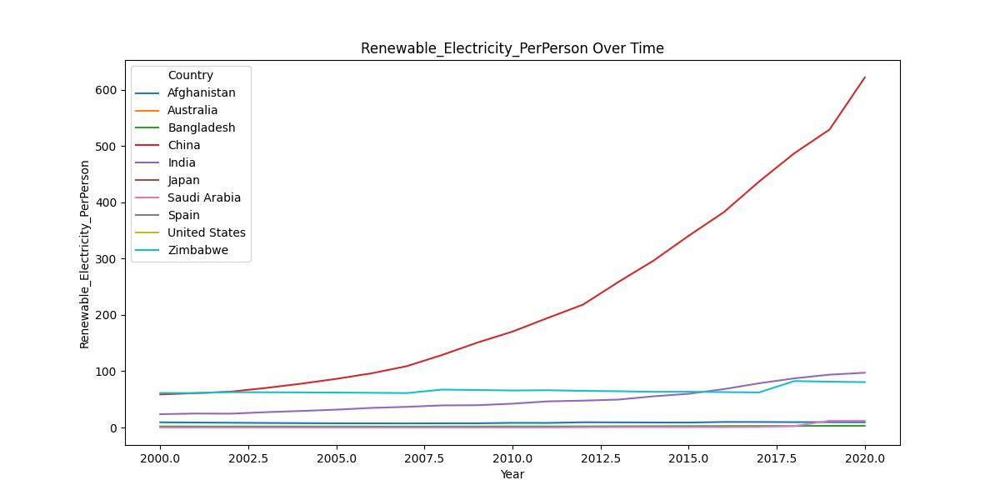

# Sustainability

### DataSet used : 
Global Data on Sustainable Energy (2000-2020) : 
https://www.kaggle.com/datasets/anshtanwar/global-data-on-sustainable-energy

## 1) Business Understanding

### Objective:

I will use this dataset showcasing sustainable energy indicators and other useful factors across all countries from 2000 to 2020. I will dive into vital aspects such as electricity access, renewable energy, carbon emissions, energy intensity, Financial flows, and economic growth. 

### Key Questions:

1. Showcase Sustainable Energy Indicators for all countires
2. How are the nations going to perform in the future against their SDG7 goals
3. Find whether a country's renewable energy consumption is above or below the median.
4. Predict CO2 emissions for all the countries

### Success Criteria:

The Machine Learning alogrithm proposed will enable goverment of all countires to track progress towards Sustainable Development Goal 7, and gain profound insights into global energy consumption patterns over time.

## 2. Data Understanding

### Objective 
Familiarize with the dataset, understand the features, and assess the target variable.

### 2.1 Data Collection
-> The dataset has Global Data on Sustainable Energy (2000-2020).

-> The dataset consist of 176 countires

-> 15 Key Features out of the 21 columns from the dataset that I will use for my analysis are :

> 'Year','Country', 'Electricity_Access_Percent', 'CleanFuel_Access_Percent','Renewable_Electricity_PerPerson','Financial_Aids_Dollars','Renewable_Energy_Consumption_AgainstTotalEnergy_Percent','Electricity_from_Fossil_Fuels_TWH','Electricity_from_NuclearPower_TWh','Electricity_from_RenewableSource_TWh','LowCarbon_Electricity_Percent','Primary_Energy_Consumption_PerPerson_kWh', 'Co2_Emission_PerPerson_MetricTon','Annual_GDP_Growth_Percent','GDP_PerPerson_Dollars'

### 2.2 Exploratory Data Analysis (EDA)

**Key Features**:

**Country** : The name of the country or region for which the data is reported.

**Year** : The year for which the data is reported, ranging from 2000 to 2020.

**Electricity_Access_Percent** : The percentage of population with access to electricity.

**CleanFuel_Access_Percent** : The percentage of the population with primary reliance on clean fuels.

**Renewable_Electricity_PerPerson** : Installed Renewable energy capacity per person

**Financial_Aids_Dollars** : Aid and assistance from developed countries for clean energy projects.

**Renewable_Energy_Consumption_AgainstTotalEnergy_Percent** : Percentage of renewable energy in final energy consumption.

**Electricity_from_Fossil_Fuels_TWH** : Electricity generated from fossil fuels (coal, oil, gas) in terawatt-hours.

**Electricity_from_NuclearPower_TWh** : Electricity generated from nuclear power in terawatt-hours.

**Electricity from renewables (TWh)** : Electricity generated from renewable sources (hydro, solar, wind, etc.) in terawatt-hours.

**LowCarbon_Electricity_Percent** : Percentage of electricity from low-carbon sources (nuclear and renewables).

**Primary_Energy_Consumption_PerPerson_kWh** : Energy consumption per person in kilowatt-hours.

**Co2_Emission_PerPerson_MetricTon** : Carbon dioxide emissions per person in metric tons.

**Annual_GDP_Growth_Percent** : Annual GDP growth rate based on constant local currency.

**GDP_PerPerson_Dollars** : Gross domestic product per person.

# Objectives 1 : : Showcase Sustainable Energy Indicators

The provision of adequate and reliable energy services at an affordable cost, in a secure and environmentally benign manner and in conformity with social and economic development needs, is an essential element of sustainable development.

### 1.1 Features Exploration

**Features to be used** :
'Year', 'Country', 'Electricity_Access_Percent',  'CleanFuel_Access_Percent', 'Renewable_Electricity_PerPerson', 'Co2_Emission_PerPerson_MetricTon'

## 1.2. Data Preparation

**Step1: key indicators :**
Visualize key indicators related to sustainable energy, such as electricity access, renewable energy consumption, carbon emissions, and energy intensity.**

Here we will Filter data for 10 selected countries to minimize higher computational requirement
'United States', 'China', 'India', 'Afghanistan', 'Australia', 'Bangladesh', 'Saudi Arabia' 'Mozambique', 'Spain', 'Zimbabwe'

**Step 2: Analyze Vital Aspects :** 
We will focus on specific areas such as electricity access, renewable energy, carbon emissions, energy intensity, financial flows, and economic growth.

**Step 3 Compare Nations and Track Progress :**
We will compare different countries and track their progress towards Sustainable Development Goal 7.

**Step 4: Insights into Global Energy Consumption Patterns :**
We will identify trends and patterns in global energy consumption over time.

# Objective 2 :: How are the nations going to perform in the future against their SDG7 goals

Built a time series model to track progress in electricity access, clean fuel access, renewable electricity per person, and CO2 emissions per person over the next four years

### Step 2: Data Processing 
Features to be uses to built a Time Series Model

Year','Country', 'Electricity_Access_Percent', 'CleanFuel_Access_Percent', 'Renewable_Electricity_PerPerson', 'Co2_Emission_PerPerson_MetricTon'

Handle missing values using KNN Imputation

knn_imputer = KNNImputer(n_neighbors=5)

After imputation, there are no missing values:

Year                                0
Country                             0
Electricity_Access_Percent          0
CleanFuel_Access_Percent            0
Renewable_Electricity_PerPerson     0
Co2_Emission_PerPerson_MetricTon    0

### Step 2: Extract Relevant Features
Select the required features and ensure they are in the correct format.

